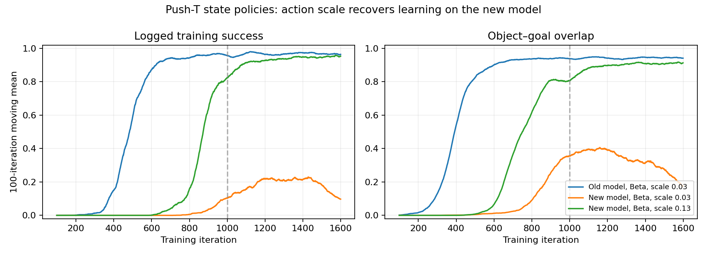

# Push-T robot training diagnosis — 2026-09-24

Compared live W&B configs, full metric histories, run git metadata, repository history, and both XMLs. No training or hardware commands were run; source code was not changed.

## Strongest finding: action scale does not transfer between these dynamics

The two new-model runs differ in saved functional configuration only in joint action scale and its corresponding clip. Their commits differ only in that setting and accompanying tests.

| Run | Robot | Scale | Mean logged success, iterations 1500–1599 | Mean overlap, iterations 1500–1599 |
| --- | --- | --- | --- | --- |
| [n178ph6p](https://wandb.ai/eduard-nicolae-robot-learning/mjlab/runs/n178ph6p) | Old realistic, Beta | 0.03 | 96.38% | 0.9412 |
| [1uqeno3i](https://wandb.ai/eduard-nicolae-robot-learning/mjlab/runs/1uqeno3i) | New identified, Beta | 0.03 | 9.73% | 0.1754 |
| [riroa30p](https://wandb.ai/eduard-nicolae-robot-learning/mjlab/runs/riroa30p) | New identified, Beta | 0.13 | 95.32% | 0.9131 |

All three retain the velocity-hinge penalty and use entropy coefficient 0.02. The new-model pair uses the same seed, network, PPO settings, environment count, simulation settings, and curricula. Their commits are 1cdab82 and 71826e0 respectively. These are training metrics from single runs, not independent evaluation success rates. Episode success records whether the object ever meets the overlap threshold during an episode.

The current HEAD, 7271a3c, removes the velocity penalty but also reverts ACTION_SCALE from 0.13 to 0.03. Thus current defaults do not retain the successful action-scale configuration.

## Control mechanism

Push-T uses RelativeJointPositionAction: target = current position + scale * action. The installed MJLab recomputes this target every physics substep (5 ms; four substeps per policy action). This is a position error applied continually, not an accumulated position target. Reducing position gain therefore directly reduces command authority for a given action. MuJoCo position-actuator reference: https://mujoco.readthedocs.io/en/stable/XMLreference.html#actuator-position

Old kp = [200, 200, 200, 100, 50, 50]; new kp = [65.092, 83.699, 115.808, 45.973, 11.365, 4.389]. Damping also changes: the old model has actuator velocity feedback [10, 10, 10, 5, 5, 5], while the new model has joint damping [14.174, 8.019, 0.726, 2.316, 2.368, 0.685]. Armature changes too. Calling the entire new model uniformly slower misses these joint-specific differences.

A CPU MuJoCo probe used the home pose, gravity compensation, implicitfast, 5 ms steps, no contacts or command delay, one continuously commanded joint at a time, both signs, and a 0.5 s horizon. Average base-joint speed at scale 0.03 fell from 0.571 to 0.119 rad/s; new-model scale 0.13 restored it to 0.515 rad/s. Elbow response was much faster on the new model. These are isolated control-response measurements, not task rollout velocities or hardware validation.

## Other explanations and limits

- The velocity penalty is a plausible secondary constraint, but the evidence does not establish it as the main failure cause: scale 0.13 succeeds with it enabled and with a much larger logged penalty. At scale 0.03, overlap averaged 0.3552 immediately before the iteration-1000 weight change and 0.3963 immediately after; this is not an immediate collapse at the switch. Performance worsens later. A completed no-penalty comparison is needed to attribute that deterioration.
- The no-penalty run pefvspmj was only at iteration 232 in the fetched history. It cannot yet settle the ablation.
- Both Beta and Gaussian policies learn on the old model. Beta also learns on the new model at scale 0.13, so Beta is not sufficient to explain failure.
- The successful new-model run still has near-zero success around iteration 500 and learns later. The state runner default of 500 iterations is too short to judge it against this successful run.
- Gravity compensation was explicitly added by 1cdab82 and is present now. In the isolated zero-action probe, the current model holds position to numerical precision; disabling compensation produces substantial drift. This issue is already addressed in both compared new-model runs.
- These comparisons are state policies, so visual randomization does not explain their difference. They end before the goal-yaw curriculum begins at iteration 3000; they do not establish full-yaw performance or visual-policy transfer.

## Suggested next experiment

Keep the identified physics and gravity compensation. Use the successful scale-0.13 configuration as the reference, run at least 1600 iterations, and vary only the velocity penalty. Retain the ongoing scale-0.03/no-penalty run as a separate ablation. For a longer-term control design, evaluate per-joint action scales because the base and elbow have very different response changes. Validate any changed action contract against deployment separately.

